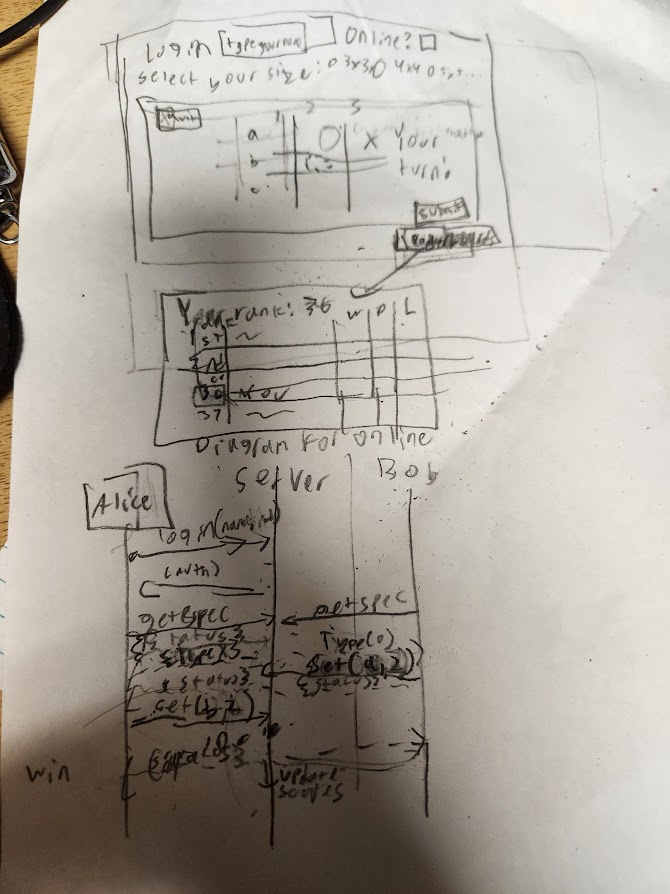

# Custom Sized TicTacToe
## Elevator pitch
Tic tac toe is an old game, but it never fails to be a fun time for all people involved. But just using the 3x3 grid is very boring and predictable. Introducing a site where you can play tic tac toe in any size, whether it be a 3x3 game, or up to even a 6x6 game! Play with people around the world, or against just the computer. All you have to do is login, select your desired game, state whether you want an online or offline game, and wait for someone else to come and play with you! Regardless of how you do it, it is bound to be fun.
## Design

Rough Sketch of how website is designed.
## Key Features
* Secure Login over HTTPS
* Ability to select online or offline capability
* Ability to select original size of tic-tac-toe grid
* Ability to change position of desired move before submitting it
* Ability to see whethe you win, tie, or lose a game
* Storage of win loss record versus other online players

## Technologies
I am going to use the following technologies in the following ways
* **HTML** - Use correct HTML structure for application. Going to have 4 HTML Pages: Home page, about page, play page, and score page
* **CSS** - Application styling that looks good on different screens, color, contrast, etc.
* **JavaScript** - Used for login, specifying game to play, and helps to play tic tac toe game
* **Service** - Backend endpoints for:
  - login
  - selecting game size
  - connecting and managing a game
  - updating scores
* **DB** - storing scores and users in a database
* **Login** - Register and login users. Credentials and win-loss record stored in database. Can't play without login
* **WebSocket** - As one player submits the move, the other player can see that move on their side
* **React** - Application ported to use the React web framework

## HTML Deliverable
For this Delverable, I built out the structure using HTML
* **HTML** 4 HTML pages, representing a score page, the gameplay page, the home page, and the about page
* **Links** All 4 pages can be linked to each other, via navigation, and via the login
* **Text** When selecting a grid size, text is implemented
* **Login** The login placeholder and submit represents the eventual login form
* **Database** The record updating is going to be a call to the database, and so are the three tables in the score page
* **Websocket** The entire 256 radio buttons shown in the game is going to represent the input of the player and the websocket call of the opponent. Also the notification bar is websocket.
