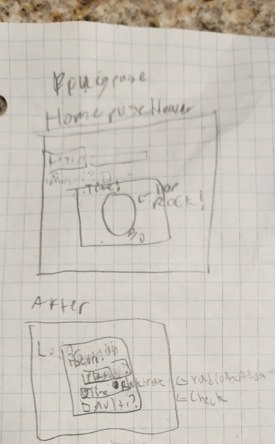

# Break Rock Simulator
## Elevator pitch
It's time for a test of concentration, speed, and skill. Tap the rock as fast as you can possibly can! Play with friends, or seek to just improve it by yourself. The faster you tap, the faster it breaks! You can try to see how fast you can break it, or how far you get in a minute! Play it your way, and have fun!
## Design

Rough Sketch of how website is designed.
## Key Features
* Secure Login over HTTPS
* Ability to select online or offline capability
* Ability to choose to play for when you break the rock, or how far you get in a certain time period.
* Ability to only start timing on imput
* Ability to see other's scores, on multiplayer, when you finish your round
* Storage of times in both time per rock, and percent per rock broken in minute

## Technologies
I am going to use the following technologies in the following ways
* **HTML** - Use correct HTML structure for application. Going to have 4 HTML Pages: Home page, about page, play page, and score page
* **CSS** - Application styling that looks good on different screens, color, contrast, etc.
* **JavaScript** - Used for login, specifying game to play, and helps to play the game, and for unique animation if the won the game.
* **Service** - Backend endpoints for:
  - login
  - finding games that are in queue to be played
  - storing and accessing data, in both formats.
* **DB** - storing scores and users in a database
* **Login** - Register and login users. Credentials and time record stored in database. Can't play without login
* **WebSocket** - For multiplayer. Will see the other player's score when they are done, and whether they won or loss.
* **React** - Application ported to use the React web framework
* **Database** The record updating is going to be a call to the database, and so are the three tables in the score page
* **Websocket** Whenever a player completes a game with someone else (either breaking the rock, or time runs out),
                they will be notified of the other's players score, and whether they win or lose

## HTML Deliverable
For my delivearable, I did the following things:
* Cloned simon application, and used it as the base for my game
* Edited the Simon HTML files to allow for my application, such as:
  - changing the header in all pages to be a navigation bar linking to the correct pages
  - changing the footer to be a link to this site, with my name
  - adding in the base html for the game (just a checkbox currently. CSS and Javascript will change that)
  - added in method to set it to breaking rocks in a time limit, or how long it takes to break a single rock.
  - Added placeholder table for database gets. Database updates will probably be updated via JS.
  - Added placeholder websocket calls, to get other players score if in multiplayer.
* Deployed it to my site at tinyplushyumbreon.com

## CSS Deliverable
For this Deliverable, I did the following things
* Clonded Simon application, and deployed it, using it as a reference for my base
* Edited and repurposed the Simon CSS files for my CSS stuff, mainly by using the same main background
* Figured out how to make a unique representation of my game on the file, including playing around with the z-index attribute, which allowed elements to overlap each other
* Laid the groundwork for the Java Script application
* Successfully installed Bootstrap in my code
* Deployed to my site at tinyplushyumbreon.com

## JS Deliverable
For this deliverable, I did the following:
* Added Js code to the login to keep track of online players, and allow offline players to play the game without saving thier score
* Implemented the necessarry features to play the game
* Implemented the features necessary to store the scores of the player in a mock database (if they login)
* Implemented the mechanism to show the database in my websites scores subpage
* Deployed simon-js to subdomain simon, correctly, this time, I may add.
